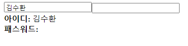
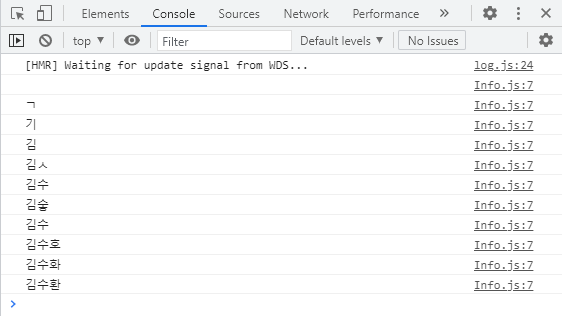
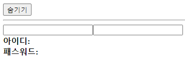
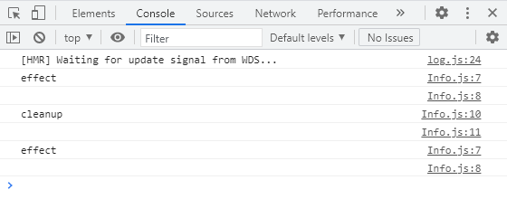
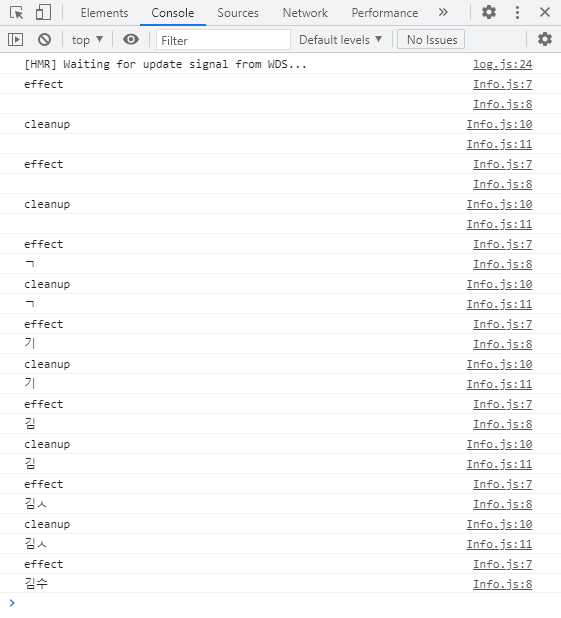

# 현재 파일은 실험용 파일입니다

목차  
[1.React Hook을 이해하기 위한 기초 지식입니다](#React-Hook을-이해하기-위한-기초-지식입니다)

---

## React Hook을 이해하기 위한 기초 지식입니다
이 내용은 **Minjun Kim** 님의 [리액트 Hooks 완벽 정복하기](https://velog.io/@velopert/react-hooks)를 공부한 내용입니다.
  
## 1. useState
```useState``` 는 가장 기본적인 **Hook**입니다. 함수형 컴포넌트 상태를 관리할때 주로 사용합니다. 사용할 때는 ```import``` 내용에 ```{ useState }```를 추가해주면 사용 가능합니다.
>예시  
```js
import React, { useState } from 'react'
```
기본적인 사용 방법은 배열 비구조화 할당 문법과 같이 사용합니다. 배열을 이용한 간단한 예제를 보겠습니다.
>예시
```js
const array = ['dog', 'cat', 'sheep'];
const [first, second] = array; // useState의 경우
//const [value, setValue] = useState(0);
console.log(first, second); // dog cat
```
위의 내용을 이용할 경우 함수형 컴포넌트에서 상태 관리가 가능합니다.

## 2. useEffect
```useEffect```는 리액트 컴포넌트가 랜더링 될 때마다 특정 작업을 수행하도록 설정 할 수 있는 **Hook**입니다.
>예시
```js
import React , { useEffect } from 'react'
```

간단한 예제를 하나 만들어 보겠습니다.
>예제
```js
import React, { useState, useEffect } from 'react';

const Info = () =>{
    const[id, setId] = useState('');
    const[password, setPassword] = useState('');
    useEffect(() => {
        console.log({
            id,
            password
        });
    });

    const onChangeId = e => {
        setId(e.target.value);
    };
    
    const onChangePassword = e => {
        setPassword(e.target.value);
    };

    return (
        (...)
    )
}
```
보기와 같이 작성했을 경우 아래와 같이 보입니다.

  
그리고 콘솔에는 다음과 같이 출력됩니다.


```useEffect``` 는 기본적으로 랜더링 직후 실행이 됩니다. 여기에 추가를 할 수 있는 부분은 **cleanup** 함수가 있습니다.   
**cleanup** 함수는 만약 컴포넌트가 언마운트되기 전이나, 업데이트 되기 직전에 어떠한 작업을 수행하고 싶을때 사용할 수 있습니다. 간단한 예시를 보겠습니다
  
  Info 컴포넌트의 useEffect 부분을 다음과 같이 수정합니다.
  ### Info.js - useEffect
  ```js
  useEffect(() = > {
      console.log('effect');
      console.log(name);
      return () => {
          console.log('cleanup');
          console.log(name);
      }
  })
  ```

  크게 바뀐점으로 보이는 곳은 ```return``` 부분입니다. 비슷하게 **App.js**도 바꿔보겠습니다
  ### App.js
  ```js
  import React, { useState } from 'react';
  import Info from './Info';

  const App = () => {
      const[visible, setVisible ] = useState(false);
      return(
          <div>
            <button
            onClick={() => {
                setVisible(!visible);
            }}
            >
            {visible ? '숨기기' : '보이기'}
            </button>
            <hr />
            {visible && <Info />}
          </div>
      );
  };
  ```

  실행결과는 다음과 같습니다.  
    
  
  보이기와 숨기기를 각각 눌러보면 **console**에 아래와 같이 출력이 됩니다.  
    

  아까와 같이 아이디란에 글자를 입력하게 되면 아래와 같이 출력됩니다.  
    

  만약 오직 언마운트 될 때만 뒷정리 함수를 호출하고 싶다면 ```useEffect``` 함수의 두번째 파라미터에 비어있는 배열을 넣으면 됩니다.

  ### Info.js - useEffect
  ```js
  useEffect(() => {
      console.log('effect');
      console.log(name);
      return () => {
          console.log('cleanup');
          console.log(name);
      };
  }[])
  ```

  ## 3. useContext