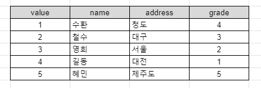

# 해당 파일은 DB공부 내용입니다.

목차  
[1. sql 기본내용](#sql_기본내용)  

---
## sql 기본내용  
### 1. 기초 내용
SQL = Structured Query Language   
**데이터 베이스**와 대화하기 위해 특별히 디자인된 언어 입니다.

SQL은 크게 두가지로 나눌 수 있습니다.  
1. Relational (SQL)
2. Non Relational (NON-SQL)  

SQL의 예시로는 Mysql, Postgresql, Sqlite가 있습니다.  
NON-SQL의 예시로는 MongoDB, DynamoDB, CouchDB가 있습니다. 

SQL의 경우 많은 회사들이 널리 쓰고 있습니다. 주로 회사, 정부기관, 은행 등등 다수 기관들이 SQL을 사용하고 있습니다. 그렇기 때문에 SQL이 **업계 표준**이 된것입니다. 

### 2. 작동 원리
SQL의 생김새 자체는 엑셀 문서와 똑같습니다. 데이터베이스에는 **테이블**이 존재하고 엑셀에는 비슷한 개념인 **시트**가 있습니다. 각각의 테이블과 시트는 모두 **행**과 **열**이 존재합니다. 

행과 열에 각각 아래과 같은 값이 있다고 가정해보겠습니다.  
  
해당 friends라는 이름의 테이블에서 address에 해당하는 값을 모두 가져온다고 한다면 아래와 같이 커맨드를 입력하면 되겠습니다.
```sql
SELECT email FROM friends;
```  
커맨드를 보면 바로 알아볼 수 있듯이 전부 영어로 표현이 되있습니다. 그러면 이번엔 학년이 5학년보다 작은 친구의 주소만 불러와 보겠습니다.  

```sql
SELECT email FROM friends WHERE grade < 5;
```  
이 커맨드도 똑같이 영어와 거의 유사한 표현방식을 가져서 읽는데 크게 불편한 점이 없습니다. 


지우는 개념도 영어를 이용해 매우 간단합니다. value 2번 값에 있는 것을 지워보겠습니다.

```sql
DELETE FROM friends WHERE id = 2;
```

이번에는 grade의 값에서 2에서 4사이의 값만 들고와 보겠습니다.
```sql
SELECT address
FROM friends
WHERE grade BETWEEN 2 AND 4
```

이는 모두 **SQL의 커맨드**이며 영어와 매우 유사하기 때문에 다루기가 매우 유용합니다.

이렇게 간단한데 수 많은 개발자가 SQL을 건드리지 못하는 이유는 매우 간단합니다. ORM 개념 때문입니다.

### 3. ORM 개념
ORM이 하는 일을 예로 들면 **파이썬을 가져와서 SQL로 바꿔주는 일**을 합니다. ORM개념 덕분에 **파이썬으로 코딩을 하면 SQL코드**를 얻을 수 있는 것입니다. 

그래서 ORM은 정말 자주 쓰입니다. 파이썬의 경우 **장고 ORM**이 있습니다. 라라벨의 경우 **eloquent ORM**, **nodeJS**의 경우 **Sequelize** 혹은 **type ORM**이 있습니다. 이것들은 매우 편하고 간단하게 만들어 줍니다.

**문제**는 개발자들이 너무 **ORM에 의존**한다는 것입니다.

개발자라면 당연하게 파이썬, SQL을 번갈아가며 코딩을 하기보단 한 공간에서 계속 작업을 처리하는 것을 선호할 것입니다. 단점은 ORM에 문제가 생겼을때 혹은 작업을 더 빨리 처리하고 싶을 때 **어떻게 대처해야 할지 모른다는 것**입니다. 

그렇기 때문에 ORM에 너무 의존하지 말고 한계점을 왔을 때를 대비해서 SQL을 공부하는 것입니다.
> ORM이 느려졌다거나 문제가 생겼을 때 SQL을 직접 뜯어보면서 대처할 수 있습니다.